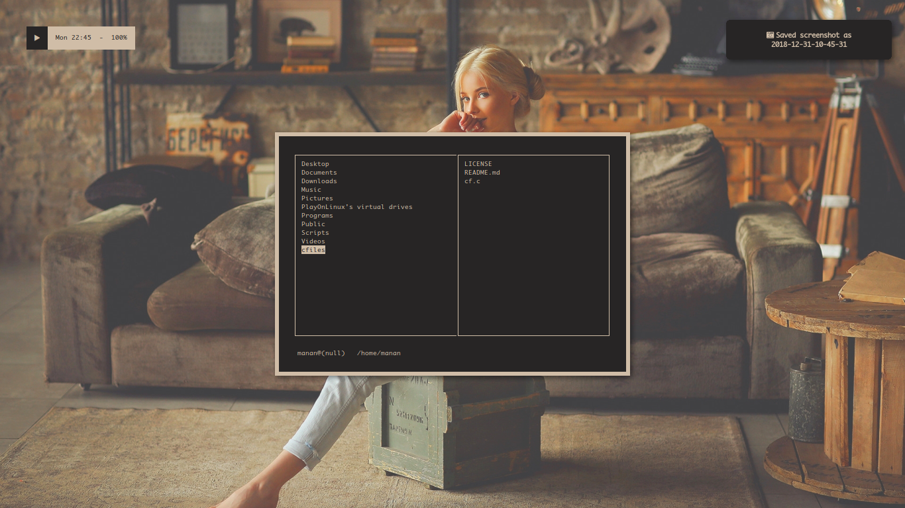

<h1 align="center">cfiles</h1>

`cfiles` is a terminal file manager with vim like keybindings, written in C using the ncurses
library. It aims to provide an interface like [ranger](https://github.com/ranger/ranger) while being lightweight, fast and
minimal.

## Dependencies
- `ncursesw`
- `cp`and `mv` for copying and moving
- `fzf` for searching
- `w3mimgdisplay` or `Überzug` for image previews
- `mediainfo` for viewing media info and file sizes
- `atool` for archive previews
- `poppler`(specifically `pdftoppm`) for pdf previews

## Compiling and Installation
#### Arch Linux
Arch Linux users can use the [AUR](https://aur.archlinux.org/packages/cfiles) package.

#### macOS
macOS users can use [brew](https://github.com/mananapr/homebrew-cfiles) or [macports](https://github.com/macports/macports-ports/tree/master/sysutils/cfiles)

#### Others
To compile, run

    make

and then run,

    sudo make install

to install.

## Keybindings
| Key | Function |
|:---:| --- |
| <kbd>h j k l</kbd> | Navigation keys |
| <kbd>G</kbd> | Go to end |
| <kbd>g</kbd> | Go to top |
| <kbd>H</kbd> | Go to top of current view |
| <kbd>M</kbd> | Go to middle of current view |
| <kbd>L</kbd> | Go to bottom of current view |
| <kbd>pgup</kbd> | Scroll Up One Page |
| <kbd>pgdn</kbd> | Scroll Down One Page |
| <kbd>f</kbd> | Search using fzf |
| <kbd>F</kbd> | Search using fzf in the present directory |
| <kbd>S</kbd> | Open Shell in present directory |
| <kbd>space</kbd> | Add/Remove to/from selection list |
| <kbd>tab</kbd> | View selection list |
| <kbd>e</kbd> | Edit selection list |
| <kbd>u</kbd> | Empty selection list |
| <kbd>y</kbd> | Copy files from selection list |
| <kbd>v</kbd> | Move files from selection list |
| <kbd>a</kbd> | Rename Files in selection list |
| <kbd>dd</kbd> | Move files from selection list to trash |
| <kbd>dD</kbd> | Remove selected files |
| <kbd>i</kbd> | View mediainfo and general info |
| <kbd>I</kbd> | View preview |
| <kbd>.</kbd> | Toggle hidden files |
| <kbd>b</kbd> | Toggle borders |
| <kbd>'</kbd> | View/Goto bookmarks |
| <kbd>m</kbd> | Add bookmark |
| <kbd>E</kbd> | Edit bookmarks |
| <kbd>p</kbd> | Run external script |
| <kbd>r</kbd> | Reload |
| <kbd>q</kbd> | Quit |

## Directories Used
`cfiles` uses `$XDG_CONFIG_HOME/cfiles` directory to store the clipboard file. This is used so that the clipboard
can be shared between multiple instances of `cfiles`. That's why I won't be adding tabs in `cfiles` because multiple
instances can be openend and managed by any terminal multiplexer or your window manager.
Note that this also means the selection list will persist even if all instances are closed.

`cfiles` also uses `$HOME/.local/share/Trash/files` as the Trash Directory, so make sure this directory exists before you try to delete a file.

For storing bookmarks, `cfiles` uses `$XDG_CONFIG_HOME/cfiles/bookmarks` file. Bookmarks are stored in the form `<key>:<path>`. You can either edit this file directly
or press `m` in `cfiles` to add new bookmarks.

`cfiles` looks for external scripts in the `$XDG_CONFIG_HOME/cfiles/scripts` directory. Make sure the scripts are executable before moving them to the scripts directory.

If `$XDG_CONFIG_HOME` is not set, then `$HOME/.config` is used.

## Opening Files
You can set `FILE_OPENER` in `config.h` to specify your file opening program. It is set to use `xdg-open` by default but you can change it to anything like `thunar`. macOS users need to set it to `open`.

## Image Previews
You can either go with `w3mimgdisplay` or `Überzug` ([link](https://github.com/seebye/ueberzug)) for image previews.
Each method has it's own pros and cons.

1. **Überzug**

To use `Überzug` for image previews, set `DISPLAYIMG` and `CLEARIMG` in `config.h` to the paths of `displayimg_uberzug` and `clearimg_uberzug` scripts respectively.
  * Pros
    1. Better previews when compared to `w3mimgdisplay`
  * Cons
    1. Can't generate previews for mp3 album arts
    2. Non functional scrolling with arrow keys

I recommend `Überzug` because the previews scale well with change in terminal size and don't disappear on changing workspaces.

2. **w3mimgdisplay**

To use `w3mimgdisplay` for image previews, set `DISPLAYIMG` and `CLEARIMG` in `config.h` to the paths of `displayimg` and `clearimg` scripts respectively.
  * Pros
    1. Faster scrolling
    2. Can generate previews of album arts for mp3 files
  * Cons
    1. Previews are very inconsistent and may disappear on resizing the terminal or changing workspaces
    2. You may have to redraw the UI while scrolling by pressing `KEY_RELOAD` (defaults to <kbd>R</kbd>)

You may have to modify the scripts a little, about which you can read [here](https://wiki.vifm.info/index.php/How_to_preview_images).

## Why C?
I wanted to improve my C and learn ncurses so I decided this would be an ideal project.

Apart from this, I have always wanted an alternative to ranger that is faster while still having
a similar UI.
